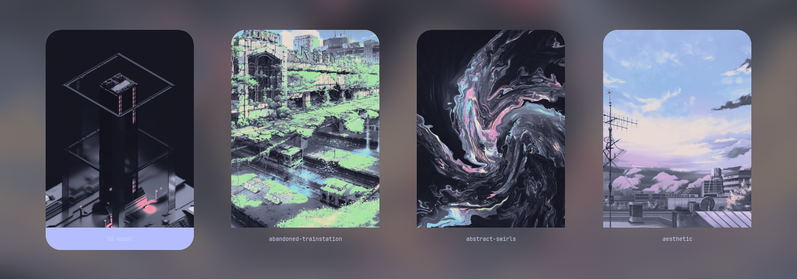

<h1 align="center">🧱 wall-engine</h1>
<p align="center">
  
  
  
</p>

<p align="center"><strong>Dynamic Wallpaper Switcher with Live Wallpaper Support, SDDM Sync & Thumbnail Previews</strong></p>

<p align="center">
  
</p>

---

## ✨ Features

- 🎨 **Beautiful GUI with Rofi** — Previews thumbnails with icons and titles.
- 🧠 **Smart Thumbnail Generation** — Automatically crops and centers both images and videos.
- 🎥 **Live Wallpaper Support** — Seamless `mpvpaper` integration.
- ⚙️ **Syncs with SDDM** — Updates blurred login screen background.
- 💡 **Wayland-first** — Designed for Hyprland + `swww`, works with other Wayland setups.
- 🔥 **Fast, Minimal, Scripted** — No bulky dependencies or GUIs.

---

## 🚀 Preview



---

## 🎬 Demo

[](demo.mp4)


---

## 🛠️ Requirements

Ensure the following tools are installed:

| Tool         | Purpose                        |
|--------------|--------------------------------|
| `rofi`       | Wallpaper selector GUI         |
| `swww`       | Static wallpaper manager       |
| `mpvpaper`   | Live wallpaper engine          |
| `ffmpeg`     | Video thumbnail extraction     |
| `ImageMagick`| Image processing               |
| `dunstify`   | Notification popup             |

Install via:

```bash
# Arch Linux
sudo pacman -S rofi swww ffmpeg imagemagick dunst
yay -S mpvpaper-git
